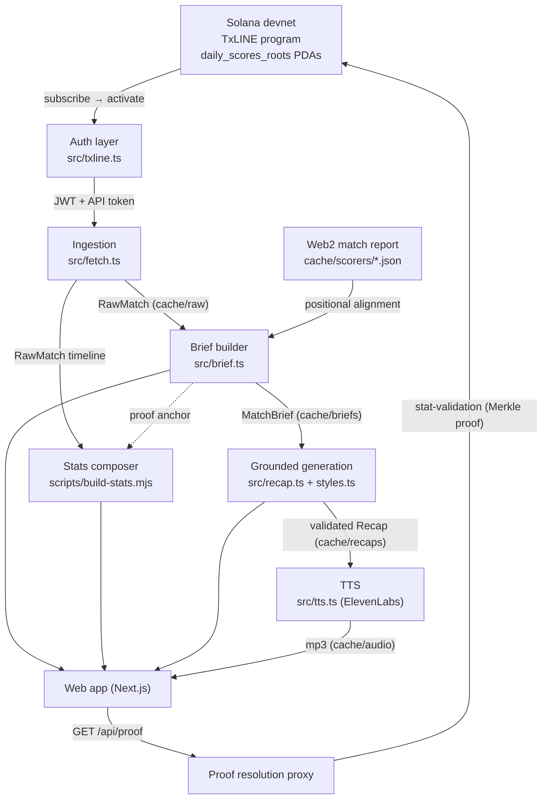

# ProofCast — A Protocol for Verifiable, Grounded Sports Storytelling

**A whitepaper on turning cryptographically-anchored match data into audit-ready, AI-narrated match recaps.**

Version 1.0 · Network: Solana devnet · Data source: TxLINE (TxODDS) · Competition scope: FIFA World Cup 2026 (competition id `72`)

---

## Abstract

Sports fans consume an enormous volume of match data and AI-generated commentary, almost none of which is provably true. Every site reports slightly different numbers, and no consumer product can show *where a figure came from* or *that it was not fabricated*. ProofCast is a protocol and reference application that closes this gap end to end. It ingests match data from **TxLINE**, whose every statistic is anchored on-chain via a daily Merkle-root scheme on Solana; derives a minimal, verifiable **MatchBrief**; and uses that brief as the *sole* input to a grounded language-model pipeline that produces a persona-styled, spoken recap. Every factual claim in the output resolves to an on-chain proof coordinate a fan can independently verify.

The core contribution is a strict, end-to-end **provenance chain**: `on-chain Merkle root → per-stat proof → MatchBrief event → cited sentence → rendered "verify" link`. At no point is a fact permitted to enter the pipeline without a resolvable proof, and at no point is the language model shown anything it is not allowed to state. The result is AI sports content with a receipt behind every sentence.

---

## 1. Motivation

### 1.1 The trust deficit in sports data

Consumer sports data is a chain of unverifiable intermediaries. A statistic is observed by a data collector, passed through one or more aggregators, reformatted by a publisher, and finally shown to a fan — who has no way to audit any link in that chain. When two sources disagree, there is no ground truth to appeal to. When an AI system generates a "match recap," the problem compounds: language models hallucinate scorers, minutes, and scorelines that never happened, and the reader cannot tell fabricated detail from fact.

### 1.2 The opportunity

TxLINE anchors sports data on-chain: each score, stat, and fixture is committed to Solana under a daily Merkle-root scheme, so any individual figure can be proven to belong to a published, immutable root. This makes it possible — for the first time in a consumer product — to build an experience where *the data layer is cryptographically verifiable* and *the presentation layer refuses to state anything the data layer cannot back*.

ProofCast is the demonstration of that thesis: a mainstream-feeling fan product (no wallet, no sign-up, no crypto vocabulary) sitting on a foundation of provable truth.

---

## 2. Design goals and non-goals

**Goals.**

1. **Verifiability by default.** Every user-visible fact — goals, cards, corners, shots, possession, the scoreline, and every sentence of narration — must resolve to an on-chain proof coordinate.
2. **No fabrication.** The generation layer may only ever assert facts present in a verified brief; violations must fail closed, not degrade silently.
3. **Explicit trust tiers.** Where a fact is *not* on-chain (a player's name), its provenance must be labelled distinctly and never blurred with on-chain verification.
4. **Zero web3 friction for the fan.** No wallet, no signing, no chain vocabulary in the default experience.
5. **Deterministic, reproducible artifacts.** Every stage caches to disk; re-running never re-hits a paid or rate-limited API for data already fetched.

**Non-goals.**

- Real-time / live-match streaming (the protocol targets *completed* matches; the feed's per-fixture live stream is explicitly not used for finished games).
- Mainnet operation (the reference implementation is devnet-only by design; see §12).
- Editorial opinion as fact — tone and colour are welcome, invented facts are not.

---

## 3. Trust model

ProofCast draws a hard line between two classes of fact and never lets them blur.

| Class | Examples | Source | Guarantee shown to the fan |
|---|---|---|---|
| **On-chain verified** | that a goal happened, for which team, the running score, the match minute, corner/card/shot/possession figures | TxLINE Merkle-proven stat slots + derived on-chain events | "🔒 verified on-chain" + a resolvable proof link |
| **Web2 attributed** | the scorer's name, the booked player's name | Public match report (e.g. FIFA / ESPN), authored once into a committed file | "name via `<source>`" — explicitly *not* an on-chain claim |

The minute of an event is treated as **on-chain verified**, because it is derived from the running match clock carried on the very same score record whose sequence and stat map are proven (§6.3). The *name* attached to a goal or card is treated as **web2 attributed** and is aligned to a verified event by position, never invented (§8).

### 3.1 Threat model

The protocol defends against the following:

- **Fabricated events / phantom goals.** Mitigated by deriving events from monotonic on-chain stat counters and reconciling event counts to the proven final score (§6.4, §7.4).
- **Revoked events (VAR-disallowed goals, corrections).** Mitigated by a decrement-aware extraction that pops tentative events when a counter drops (§6.4).
- **Model hallucination.** Mitigated by the anti-hallucination brief contract (§7) and post-generation validation that rejects fabricated citations, wrong scorelines, and reasoning leakage (§9.3).
- **Name misattribution.** Mitigated by count-checked positional alignment that *throws* on any disagreement with the chain, plus a minute cross-check (§8).
- **Proof-link forgery / dead links.** Every proof coordinate is computed deterministically from on-chain-derived values; the resolution proxy authenticates server-side so a link cannot be spoofed by a client (§10.2).

---

## 4. System architecture

ProofCast is a **pipeline protocol**: a sequence of pure, cacheable transformations from on-chain data to a rendered, verifiable experience. Each stage writes a committed artifact that the next stage consumes, so any stage can be re-run or audited in isolation.



The **guiding invariant** across all stages: *a fact without a proof coordinate cannot advance to the next stage.* Zod schemas enforce this structurally (§7.1), and runtime assertions enforce it semantically (§9.3).

---

## 5. The TxLINE verification layer

### 5.1 On-chain access as an earned credential

Unlike a conventional API key issued out-of-band, TxLINE access is **earned on-chain**. The reference implementation (`src/txline.ts`) performs the full handshake:

1. **Ensure a Token-2022 associated token account (ATA)** for the subscribing wallet against the service token mint `4Zao8ocPhmMgq7PdsYWyxvqySMGx7xb9cMftPMkEokRG`, retrying until the RPC has synced the account.
2. **Subscribe on-chain** by invoking `subscribe(service_level_id: u16, weeks: u8)` on program `6pW64gN1s2uqjHkn1unFeEjAwJkPGHoppGvS715wyP2J` via Anchor, with accounts resolved from the program's PDAs (`pricing_matrix`, `token_treasury_v2`, and the treasury's Token-2022 vault). The confirmed transaction signature `txSig` becomes the proof-of-subscription. The reference config uses `SERVICE_LEVEL_ID = 1` ("World Cup & Int Friendlies"), `DURATION_WEEKS = 4`, `SELECTED_LEAGUES = []` (the standard free bundle).
3. **Obtain a guest JWT** via `POST /auth/guest/start` (a keyless request; the JWT is valid ~30 days).
4. **Sign the activation preimage** with the *same* wallet that subscribed. The exact preimage is:

   ```
   preimage = `${txSig}:${SELECTED_LEAGUES.join(",")}:${jwt}`
   ```

   With empty leagues this collapses to `${txSig}::${jwt}` (two colons). The signature is an **ed25519 detached signature, base64-encoded**.
5. **Activate** via `POST /api/token/activate` with `Authorization: Bearer <jwt>` and body `{ txSig, walletSignature, leagues }` (note the field is `walletSignature`, not `signature`). The response is a long-lived API token (`txoracle_api_…`), returned as `text/plain` or `{ token }`.
6. **Persist** `{ wallet, apiToken, jwt, subscribeTxSig, serviceLevelId, selectedLeagues, activatedAt }` to `cache/auth.json` so the protocol never re-subscribes.

### 5.2 Dual-credential data requests

Every authenticated data request carries **both** headers:

```
Authorization: Bearer <guest JWT>
X-Api-Token:   <long-lived API token>
```

The client (`makeApiClient`) installs an interceptor that, on a `401`, refreshes the guest JWT once from the same host and retries with the same API token, writing the refreshed JWT back to the cache. This is the only recovery path needed because the JWT is long-lived; a `403` at activation indicates a preimage/wallet/encoding/network mismatch rather than expiry.

### 5.3 The Merkle proof scheme

**There is no per-event transaction signature in the feed.** Verification is a Merkle scheme:

- TxLINE publishes **daily Merkle roots** on-chain in program PDAs. The PDA for a given day is derived deterministically:

  ```
  seed      = u16 little-endian(epochDay)          // epochDay = floor(timestamp_ms / 86_400_000)
  rootPda   = findProgramAddress(["daily_scores_roots", seed], PROGRAM_ID)
  ```

- Any individual statistic is identified by the coordinate **`{ fixtureId, seq, statKey }`** — the fixture, the score-update sequence number the fact landed on, and which statistic changed.
- `GET /api/scores/stat-validation?fixtureId=…&seq=…&statKey=…` returns the Merkle proof material (`mainTreeProof`, `subTreeProof`, `statProof`) linking that stat to the published daily root.
- The program additionally exposes `validateStat` / `validateStatV2` / `validateStatV3` instructions (present in the program IDL) that verify a returned proof on-chain and emit a **validation transaction signature** — an optional per-event receipt. *The reference application resolves and displays the Merkle proof from `stat-validation` and links the fan to the on-chain root PDA; it does not itself submit the validation transaction.*

ProofCast therefore treats **`{ fixtureId, seq, statKey }` + the day's `rootPda`** as the canonical, resolvable proof for any fact: the stat-validation proof material verifies against the root PDA that anchors it on-chain. This coordinate is computed once at brief-build time (§7.2) and carried unchanged all the way to the rendered "verify" link.

---

## 6. Data ingestion and event derivation

`src/fetch.ts` transforms the live feed into a cache-able `RawMatch` bundle. Devnet reality diverges from the published OpenAPI schema in ways the implementation handles explicitly.

### 6.1 Discovering completed matches

The fixtures endpoint carries no score or status, so completion is inferred from the scores feed: `GET /api/fixtures/snapshot?competitionId=72&startEpochDay=…` lists fixtures; a match is *completed* only when its snapshot contains a `game_finalised` record and a `status` record whose `Stats` map holds the final score. Home/away orientation is resolved from each record's `Participant1IsHome` flag.

### 6.2 Timeline reconstruction

`GET /scores/snapshot/{fixtureId}` returns only the *latest* record per action type — sufficient for the final scoreline but not for the ordered event timeline. The per-fixture updates endpoint is a live SSE stream, useless for finished games. The full ordered history is therefore reconstructed by scanning the **interval endpoint** `GET /scores/updates/{epochDay}/{hourOfDay}/{interval}?fixtureId=…` across the match window (4 hours × 12 intervals), deduplicating by `Seq`, and sorting ascending.

### 6.3 Minute derivation (on-chain-anchored)

The match minute is derived from the running match clock carried on the score record:

```
minute = floor(Clock.Seconds / 60) + 1     // football minutes are 1-indexed
```

This rides on the same record whose `Seq`/`Stats` are proven, so the minute inherits the same on-chain anchor. It reproduces officially-announced minutes exactly on verified matches (e.g. a 5591-second goal → 94', i.e. 90+4). If the feed ever carries an explicit `Data.Minutes`, that is preferred.

### 6.4 Event extraction by monotonic counter walking

Events are not read from a labelled "events" feed — they are **derived from the movement of proven stat counters**, which is what makes them verifiable. For each tracked `statKey` (goals, yellows, reds per side), the extractor walks the ordered timeline and watches its value:

- **Counter increases** (`now > before`): push one tentative event per increment onto a per-key stack, recording `seq`, `ts`, `statKey`, `playerId` (if any), the derived `minute`, and `detail` (e.g. `GoalType`).
- **Counter decreases** (`now < before`): the event was **revoked** (VAR-disallowed goal, correction) — pop the stack down to the new value so revoked events never survive.

After the walk, surviving events are flattened, ordered by `seq`, and the running score is recomputed by replaying goals in order. By construction, each key's surviving event count equals its final stat value — so **the derived timeline is guaranteed consistent with the proven final score** (no phantom or missing goals).

The output `RawMatch` retains the raw snapshot, the deduped stat-bearing timeline, and any odds, so downstream stages rebuild without re-fetching. Ingestion is idempotent: cached matches are never re-fetched unless forced.

---

## 7. The MatchBrief: an anti-hallucination contract

`src/brief.ts` compiles a `RawMatch` into a **MatchBrief** — the tight, verified, schema-validated view that is the *only* thing the generation layer is ever shown. It is offline and pure: it computes proofs deterministically and never re-hits the API.

### 7.1 The schema as a gate

`src/types.ts` defines the brief as a Zod schema; a brief that does not validate is not written. Critically, **every factual element carries a `Proof`**:

```ts
Proof = {
  fixtureId, seq, statKey,          // the canonical proof coordinate
  timestamp,                        // ms, on-chain-anchored
  epochDay,                         // days since epoch → PDA seed
  rootPda,                          // daily_scores_roots PDA holding the Merkle root
  explorerUrl,                      // Solana Explorer link to that on-chain account (devnet)
  statValidationUrl,                // API endpoint returning the full Merkle proof
}
```

Each `BriefEvent` has a stable citation id (`ev_1`, `ev_2`, …), a chronological `order`, the running score after the event, an optional on-chain `minute`, an optional web2 `scorer`/`player` with its `nameSource`, and its `proof`. The brief also carries a `finalScoreProof`, aggregate `stats` (goals, cards, corners, with per-half splits when they reconcile), and machine-readable `dataNotes` (§7.3).

### 7.2 Deterministic proof construction

For any `{ fixtureId, seq, statKey, ts }`, `makeProof` computes `epochDay = floor(ts / 86_400_000)`, derives the `daily_scores_roots` PDA from the u16-LE epochDay seed, and assembles the Explorer and stat-validation URLs. Because this is a pure function of on-chain-derived values, proof links are reproducible and cannot be forged after the fact.

### 7.3 Honest data notes

`buildDataNotes` emits per-match, machine-readable statements of *what the data does and does not contain* — e.g. "minutes are available, you may state them," or "scorer names are not available — refer to teams, not named players." These notes are injected verbatim into the generation prompt as hard constraints (§9.1), so the model is told plainly what it may and may not assert for *this specific match*.

### 7.4 Consistency assertions

Beyond the schema, `assertBriefConsistency` re-checks that the number of home/away goal events equals the final score and that event ids are unique — a redundant integrity gate on top of the extraction guarantee of §6.4.

### 7.5 Half-time and per-period reconciliation

Per-period stat keys are the whole-game base key offset by period (`first half = 1000 + base`, `second half = 3000 + base`). A half-time score or per-half corner split is emitted **only if the two halves sum exactly to the full-time total**; otherwise it is omitted. ProofCast never *infers* a half-time score.

---

## 8. Web2 enrichment under integrity gates

TxLINE proves *that* a goal happened, *for which team*, and *at what minute* — but not *who scored*. Player names are the one fact ProofCast sources from web2, and it does so under strict integrity gates (`src/scorers.ts`).

- Names come from a public match report authored once into a committed `cache/scorers/<matchId>.json`, carrying its `source` provenance (name + URL).
- **Alignment is positional, not by minute.** The *k*-th verified goal for a team is credited to the *k*-th scorer the source lists for that team. The official minute is used *only* as a ±2-minute cross-check that raises a low-confidence warning — never as the alignment key — so a report that is a minute off can never misattribute a goal.
- **Count mismatches throw.** If the source lists a different number of goals (or, per card type, cards) for a team than the chain verifies, composition *fails* rather than guessing. Card buckets must be fully listed or omitted entirely; a partial bucket is refused, which is what allows naming red cards while leaving yellows team-only.
- The event stays on-chain-verified; only the *name* is web2-attributed, tagged with `nameSource`, and the UI labels it distinctly (§10.1).

---

## 9. Grounded generation

`src/recap.ts` and `src/styles.ts` turn a MatchBrief into a persona-styled recap that is grounded, cited, and validated before it is ever written to disk.

### 9.1 Prompt construction

The model is shown a **slimmed brief** — facts only, with proof URLs and PDAs stripped out (it does not need them). Each event carries a qualitative `whenRelative` pacing word derived from real inter-event timestamps ("moments later", "much later"), so the persona can pace the story honestly *without* being handed — or inventing — an absolute minute for events that lack one. The system prompt is the persona plus the non-negotiable **grounding rules**.

### 9.2 Personas

Three curated personas ship, each a persona voice atop the shared grounding rules:

- **`hype`** — explosive, partisan hometown commentator.
- **`analyst`** — dry, deadpan, numbers-obsessed tactician.
- **`bedtime`** — gentle fairy-tale narrator.

The grounding rules override the persona whenever they conflict: use only brief facts; obey `dataNotes` exactly; treat the `events` array as the complete list of what happened; cite every factual claim with its `[ev_N]` id and the final score with `[final]`; never invent venue, stage, kickoff, scorer, or minute; 300–400 words of flowing prose meant to be read aloud.

### 9.3 Post-generation validation (fail-closed)

Raw model output is validated by `finalizeRecap` *before* acceptance; any violation throws, and an ungrounded recap is never written:

1. **Prose / leakage check** — reject chain-of-thought leakage, markdown fences, or instruction echoes; enforce the 300–400-word window.
2. **Citation resolution** — every `[ev_N]` / `[final]` marker is mapped back to a real brief proof; a citation of a non-existent id throws.
3. **Scoreline assertion** — the correct final score must appear in the prose (digit and word forms accepted); a wrong or missing scoreline throws.
4. **Non-empty citations** — a recap with no citations is rejected.

On failure the generator **rotates across candidate models** (handling a flaky free tier and quota errors), with a single same-model expansion pass reserved for the under-length case. The accepted recap stores its display text (citation tags stripped), the ordered citations with their proofs, the model used, and the word count.

The output of this stage is the load-bearing claim of the whole protocol: *every cited sentence maps to a resolvable on-chain proof, and nothing else was allowed through.*

---

## 10. Delivery and verification

### 10.1 Statistics composition

`scripts/build-stats.mjs` builds the Google-style team-stats panel, distinguishing two provenance kinds:

- **Verified aggregates** (corners, yellow, red) — read from the proven `Score.Total` slots at the final stat record's `seq`, each carrying a per-side Merkle proof.
- **Derived on-chain figures** (shots, shots on target, possession) — *counted from N individual on-chain events*: shot records are deduplicated by `Id` (they are amended in place from unconfirmed → confirmed), goals are added back in (every goal is a shot, and on target), and possession share is the ratio of possession-tagged records. Each derived figure reports the number of on-chain events it was composed from.

Every row therefore traces to TxLINE — either as a single Merkle-proven slot or as a count of proven events.

### 10.2 The proof-resolution proxy

The rendered "verify on-chain" links must resolve for a fan who has no wallet and no credentials. Because `stat-validation` requires both auth headers, a raw browser link would `401`. The web app exposes `GET /api/proof?fixtureId=…&seq=…&statKey=…` (`web/app/api/proof/route.ts`), which:

- reads the long-lived API token from the deployment env (`TXLINE_API_TOKEN`) or the local auth cache,
- fetches and in-memory-caches a guest JWT (10-minute TTL), refreshing once on a `401`,
- validates that all three coordinates are numeric (rejecting malformed requests),
- and returns the pretty-printed Merkle proof JSON.

Keys never reach the browser. The fan clicks a link and sees the real proof material resolving against the on-chain root.

### 10.3 The recap route

`POST /api/recap { matchId, style, favouriteTeam? }` is cached-first: preset styles with no personalization are served straight from committed pipeline outputs (instant, zero API spend), while a favourite-team personalization runs the real generation pipeline live and server-side, so the model key never reaches the client. Pre-generated ElevenLabs audio is returned when a matching mp3 exists; personalized live output falls back to on-demand synthesis.

### 10.4 Audio narration

`src/tts.ts` renders accepted recaps to speech via ElevenLabs, one voice profile per persona (energetic / measured / soft). Audio is a quota-critical, cache-first artifact: generated once for curated recaps, committed, and served as static assets.

---

## 11. Provenance chain (summary)

The end-to-end guarantee, stated as a single chain, is:

```
daily_scores_roots PDA (on-chain Merkle root)
   └─ { fixtureId, seq, statKey }  ──stat-validation──▶  Merkle proof  (optionally ──validateStatV2──▶ validation tx)
        └─ BriefEvent.proof  (deterministic, schema-gated)
             └─ [ev_N] citation in generated prose  (validated, fail-closed)
                  └─ "verify on-chain" link in the UI  (resolved via keyless proxy → root PDA)
```

Any fan can walk this chain backwards from a sentence they heard to the on-chain root that anchors it. That is the entire protocol.

---

## 12. Limitations and future work

- **Devnet scope.** The reference implementation is devnet-only by deliberate constraint. Service level 12 (real-time) and mainnet roots are the natural production upgrade; the proof coordinate and resolution paths are network-agnostic.
- **Odds.** The brief schema models an odds timeline and computed "odds highlights" (largest win-probability swings and the events they coincide with), but devnet specimen data carries no odds, so these are empty in the current corpus. On a feed with odds, this becomes first-class narrative material — "the market swung 22 points the second that red card landed" — sourced from data, not invention.
- **Name provenance.** Scorer/booking names remain web2-attributed until an on-chain name feed exists; the trust-tier labelling is designed so this can be upgraded transparently.
- **Live matches.** The protocol targets completed matches; extending to in-play would require consuming the live SSE stream and proving stats incrementally as roots are published.

---

## Appendix A — Protocol constants (devnet)

| Constant | Value |
|---|---|
| RPC | `https://api.devnet.solana.com` |
| Program id | `6pW64gN1s2uqjHkn1unFeEjAwJkPGHoppGvS715wyP2J` |
| Service token mint (Token-2022) | `4Zao8ocPhmMgq7PdsYWyxvqySMGx7xb9cMftPMkEokRG` |
| API base | `https://txline-dev.txodds.com/api` |
| Guest auth | `https://txline-dev.txodds.com/auth/guest/start` |
| Activation | `…/api/token/activate` |
| Service level | `1` ("World Cup & Int Friendlies") |
| Duration | `4` weeks (multiples of 4) |
| Selected leagues | `[]` (standard free bundle) |
| Competition id | `72` (World Cup) |

## Appendix B — Stat-key map

| statKey | Meaning | | statKey | Meaning |
|---|---|---|---|---|
| 1 / 2 | P1 / P2 goals | | 5 / 6 | P1 / P2 red cards |
| 3 / 4 | P1 / P2 yellow cards | | 7 / 8 | P1 / P2 corners |

Per-period keys are the base key offset by period: `first half = 1000 + base`, `second half = 3000 + base`. Home/away is resolved from `Participant1IsHome`.

## Appendix C — Activation preimage

```
preimage        = `${subscribeTxSig}:${SELECTED_LEAGUES.join(",")}:${jwt}`
walletSignature = base64( ed25519_detached_sign(preimage, subscribingWallet) )
POST /api/token/activate
  headers: Authorization: Bearer <jwt>
  body:    { txSig, walletSignature, leagues }
```

## Appendix D — Repository map

| Path | Role |
|---|---|
| `src/txline.ts` | On-chain subscribe → activate handshake; dual-credential data client |
| `src/fetch.ts` | Timeline reconstruction; decrement-aware event extraction; minute derivation |
| `src/brief.ts` | RawMatch → schema-validated MatchBrief; deterministic proof construction |
| `src/types.ts` | Zod schemas (the anti-hallucination contract) |
| `src/scorers.ts` | Count-checked positional web2 name alignment |
| `src/recap.ts` | Grounded generation + fail-closed validation |
| `src/styles.ts` | Personas + non-negotiable grounding rules |
| `src/tts.ts` | ElevenLabs narration |
| `scripts/build-stats.mjs` | Verified-aggregate + derived on-chain stats panel |
| `web/app/api/proof/route.ts` | Keyless proof-resolution proxy |
| `web/app/api/recap/route.ts` | Cached-first / live recap route |

---

*ProofCast is built on TxLINE (TxODDS) verifiable on-chain sports data, anchored to Solana. Narration by ElevenLabs. The fun of a matchday recap, on a foundation of provable truth.*
